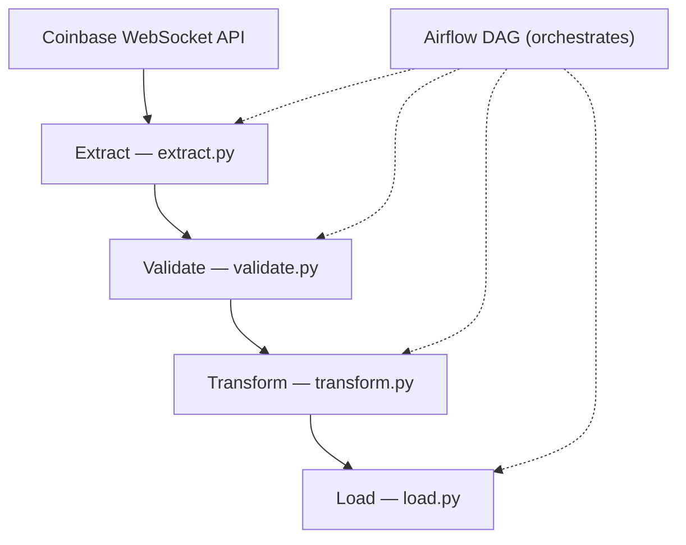

# Coinbase WebSocket ETL Pipeline — Airflow 3.x on AWS

A production-grade, **idempotent** ETL pipeline that streams real-time cryptocurrency market data from the **Coinbase WebSocket API**, transforms it with meaningful analytics enrichments, stores it on **AWS S3** (partitioned Parquet), loads it into **Amazon Redshift**, and visualises it on a **Streamlit** real-time dashboard.

Built with **Apache Airflow 3.x** (Astro Runtime 3.1) and the TaskFlow API.

---

## Architecture

The full, styled diagram is available in `etl_architecture.html` in this repository. A simplified Mermaid overview is shown below for quick reference.



### Explanation of ETL Steps

1. **Extract**: Connects to the Coinbase WebSocket API to stream real-time ticker data. This ensures we capture the latest market data efficiently.
2. **Validate**: Ensures the data adheres to the defined schema (`TICKER_RAW_SCHEMA`). This step prevents invalid or corrupted data from propagating downstream.
3. **Transform**: Adds metadata fields (`_ingested_at` and `_execution_date`) to each record for traceability and partitioning.
4. **Load**: Stores the validated and enriched data into the target storage (e.g., AWS S3 or Redshift).
5. **Airflow DAG**: Orchestrates the entire ETL process, ensuring it runs on a schedule and handles retries in case of failures.

---

## Project Structure

```
airflow_aws/
├── .env                          # Secrets (never committed)
├── Dockerfile                    # Astro Runtime 3.1 (Airflow 3.x)
├── requirements.txt              # Python dependencies
├── packages.txt                  # OS-level packages
├── airflow_settings.yaml         # Local Airflow connections/variables
│
├── dags/
│   ├── coinbase_ticker_etl.py    # Main ETL DAG (4 tasks)
│   └── exampledag.py             # Astro example
│
├── etls/                         # Reusable ETL modules (called by DAGs)
│   ├── __init__.py
│   ├── extract.py                # WebSocket extraction
│   ├── transform.py              # Price norm, spread, OHLC
│   ├── validate.py               # JSON-Schema validation
│   └── load.py                   # S3 + Redshift loading
│
├── include/
│   ├── config.py                 # Global config (reads .env)
│   ├── streaming_ingestion.py    # Always-on streaming script
│   ├── dashboard.py              # Streamlit real-time dashboard
│   └── architecture.py           # Architecture diagram generator
│
├── tests/
│   ├── test_transform.py         # Transform unit tests
│   ├── test_validate.py          # Validation unit tests
│   └── dags/
│       └── test_dag_example.py
│
└── plugins/
```

---

## What Data Comes from Coinbase WebSocket

The **ticker** channel on the Coinbase Advanced Trade WebSocket delivers a JSON message every time a trade executes:

| Field | Type | Description |
|---|---|---|
| `product_id` | string | Trading pair (e.g., `BTC-USD`) |
| `price` | string | Last trade price |
| `best_bid` | string | Highest buy order |
| `best_ask` | string | Lowest sell order |
| `best_bid_size` | string | Size at best bid |
| `best_ask_size` | string | Size at best ask |
| `volume_24h` | string | 24-hour volume |
| `open_24h` | string | 24-hour opening price |
| `high_24h` | string | 24-hour high |
| `low_24h` | string | 24-hour low |
| `last_size` | string | Last trade size |
| `side` | string | `buy` or `sell` |
| `trade_id` | int | Unique trade ID |
| `time` | string | ISO-8601 timestamp |

---

## Transformations — What & Why

### 1. Price Normalisation (`str → float`)
**Why:** Raw WebSocket prices are strings (`"43210.55"`). Casting to float enables arithmetic operations — moving averages, volatility, aggregations — without runtime casting bugs in every downstream query.

### 2. Timestamp Conversion (ISO-8601 → UTC `datetime`)
**Why:** Coinbase timestamps have mixed formats (`Z` suffix, `+00:00`). Standardising to UTC datetime ensures correct time-series joins, partition pruning, and timezone-aware dashboard rendering.

### 3. Bid-Ask Spread (`best_ask − best_bid`)
**Why:** The spread is the primary measure of **market liquidity**. A widening spread signals uncertainty, low liquidity, or market stress — critical for risk monitoring and execution-quality analysis.

### 4. Spread Percentage (`spread / mid_price × 100`)
**Why:** Absolute spread isn't comparable across assets at different price levels ($50k BTC vs $3k ETH). Percentage normalises this for cross-asset liquidity comparison on a single dashboard.

### 5. Mid-Price (`(bid + ask) / 2`)
**Why:** The mid-price is a fairer estimate of "true" market value than last trade price — used in quantitative finance for mark-to-market valuation and fair-value calculations.

### 6. 1-Minute OHLC Aggregation
**Why:** Reduces data volume by ~60× while preserving the four most important price reference points per interval. OHLC candles are the industry-standard input for:
- Technical analysis indicators (RSI, Bollinger Bands, MACD)
- Volatility estimation models (Garman-Klass, Parkinson)
- Candlestick chart rendering in dashboards

---

## Airflow DAG Tasks

The `coinbase_ticker_etl` DAG runs **every 5 minutes** with 4 tasks:

```
extract_coinbase_stream → store_raw_s3
                        → transform_ticker_data → load_to_warehouse
```

| Task | Description |
|---|---|
| `extract_coinbase_stream` | Opens WSS connection, subscribes to ticker, collects N seconds of data |
| `store_raw_s3` | Writes raw JSONL to `s3://bucket/raw/coinbase/ticker/date=YYYY-MM-DD/` |
| `transform_ticker_data` | Price normalisation, spread calc, OHLC; writes Parquet to `/transformed/` |
| `load_to_warehouse` | Idempotent DELETE + COPY into Redshift |

### Pipeline Qualities

- **Idempotent:** Re-running the same `logical_date` overwrites the same S3 partition and Redshift rows — no duplicates.
- **Retry logic:** 3 retries with exponential backoff (30s → 60s → 120s), max 5 min.
- **Logging:** Structured Python logging in every ETL module.
- **Schema validation:** JSON-Schema-based validation at extract and transform boundaries.
- **Partitioned S3 storage:** `date=YYYY-MM-DD/product=XXX/` layout enables Athena/Spectrum partition pruning.

---

## Analytical Insights This Dataset Provides

### 📊 Crypto Market Volatility
- **Rolling volatility** calculated from tick-level price returns reveals intraday volatility regimes
- **OHLC candles** feed Garman-Klass and Parkinson volatility estimators that are 5-8× more efficient than close-to-close methods
- **Use case:** Risk management, position sizing, options pricing, VaR models

### 📈 Bid-Ask Spread Analysis
- **Spread time-series** reveals liquidity patterns — tighter spreads during US market hours, wider during Asian hours
- **Spread percentage** enables cross-asset comparison (is BTC more liquid than SOL today?)
- **Sudden spread widening** flags market stress events, exchange outages, or flash crashes
- **Use case:** Execution-cost estimation, market-microstructure research, algorithmic trading

### ⚡ Trading Activity Spikes
- **Volume per minute** detects abnormal trading bursts — often precursors to large price moves
- **Trade count vs. volume** distinguishes retail flurries (many small trades) from institutional activity (few large blocks)
- **Side imbalance** (buy vs. sell volume) signals directional pressure before it shows up in price
- **Use case:** Alert systems, news-driven trading detection, exchange monitoring

### Additional Insights
- **Cross-asset correlation:** Do ETH and SOL move in lockstep with BTC, or are they decoupling?
- **Intraday seasonality:** What time of day has the tightest spreads / most volume?
- **Microstructure patterns:** Mean-reversion vs. momentum at tick level

---

## Getting Started

### Prerequisites
- [Astro CLI](https://www.astronomer.io/docs/astro/cli/install-cli) installed
- Docker Desktop running
- AWS account with S3 bucket and (optionally) Redshift cluster
- (Optional) Coinbase API key for authenticated channels

### 1. Configure Secrets

Edit `.env` with your actual values:

```bash
# Minimum required for S3 storage
AWS_ACCESS_KEY_ID=AKIA...
AWS_SECRET_ACCESS_KEY=...
S3_BUCKET_NAME=your-bucket-name

# Optional: Redshift (skip if testing S3-only)
REDSHIFT_HOST=your-cluster.us-east-1.redshift.amazonaws.com
REDSHIFT_PASSWORD=...
```

### 2. Create S3 Bucket

```bash
aws s3 mb s3://coinbase-etl-data --region us-east-1
```

### 3. Start Airflow Locally

```bash
astro dev start
```

This spins up 5 Docker containers (API Server, Scheduler, DAG Processor, Triggerer, Postgres). Access the UI at **http://localhost:8080** (user: `admin`, password: `admin`).

### 4. Enable the DAG

In the Airflow UI, find `coinbase_ticker_etl` and toggle it **ON**. It will start running every 5 minutes.

### 5. Run Streaming Ingestion (Optional)

For continuous, always-on ingestion alongside the DAG:

```bash
pip install -r requirements.txt
python include/streaming_ingestion.py
```

Or run as a Docker container:

```bash
docker build -t coinbase-stream .
docker run --env-file .env coinbase-stream python include/streaming_ingestion.py
```

### 6. Launch the Dashboard

```bash
pip install streamlit plotly websocket-client
streamlit run include/dashboard.py
```

Open **http://localhost:8501** to see live prices, OHLC charts, spread analysis, and volatility gauges.

---

## Redshift Setup (Optional)

If loading to Redshift, create the target table:

```sql
CREATE TABLE IF NOT EXISTS public.ticker_transformed (
    product_id      VARCHAR(20)    NOT NULL,
    price_usd       DECIMAL(18,8)  NOT NULL,
    timestamp_utc   TIMESTAMP      NOT NULL,
    best_bid        DECIMAL(18,8),
    best_ask        DECIMAL(18,8),
    spread          DECIMAL(18,8),
    spread_pct      DECIMAL(10,6),
    mid_price       DECIMAL(18,8),
    open_24h        DECIMAL(18,8),
    high_24h        DECIMAL(18,8),
    low_24h         DECIMAL(18,8),
    volume_24h      DECIMAL(18,8),
    volume_30d      DECIMAL(18,8),
    last_size       DECIMAL(18,8),
    side            VARCHAR(10),
    trade_id        BIGINT,
    sequence        BIGINT,
    ingest_date     DATE           NOT NULL SORTKEY
)
DISTSTYLE KEY
DISTKEY (product_id);
```

Create an IAM role for Redshift COPY and update the ARN in `etls/load.py`.

---

## Running Tests

```bash
# Install test dependencies
pip install -r requirements.txt

# Run all tests
pytest tests/ -v

# Run specific test modules
pytest tests/test_transform.py -v
pytest tests/test_validate.py -v
```

---

## Configuration Reference

All configuration is in `include/config.py`, driven by `.env`:

| Variable | Default | Description |
|---|---|---|
| `COINBASE_WS_URL` | `wss://advanced-trade-ws.coinbase.com` | WebSocket endpoint |
| `COINBASE_PRODUCTS` | `BTC-USD,ETH-USD,SOL-USD` | Comma-separated trading pairs |
| `COINBASE_CHANNELS` | `ticker` | WebSocket channels |
| `S3_BUCKET_NAME` | `coinbase-etl-data` | Target S3 bucket |
| `S3_RAW_PREFIX` | `raw/coinbase/ticker` | Raw data S3 path prefix |
| `S3_TRANSFORMED_PREFIX` | `transformed/coinbase/ticker` | Transformed data S3 prefix |
| `STREAM_DURATION_SECONDS` | `60` | Seconds per Airflow extraction window |
| `STREAM_BATCH_SIZE` | `100` | Records per streaming flush |
| `REDSHIFT_HOST` | — | Redshift cluster endpoint |
| `REDSHIFT_DB` | `coinbase_analytics` | Database name |

---

## Next Steps / Production Checklist

1. **Secrets management:** Move from `.env` to AWS Secrets Manager or Airflow Connections
2. **IAM roles:** Use instance profiles / IRSA instead of access keys
3. **Monitoring:** Add Airflow alerting (email/Slack on failure), CloudWatch metrics
4. **Data quality:** Add Great Expectations or Soda checks as DAG tasks
5. **Partitioning:** Add hourly partitions for high-volume products
6. **Schema evolution:** Version the JSON schemas, add migration logic
7. **CI/CD:** Add GitHub Actions to run tests + `astro deploy`
8. **Cost optimisation:** Use S3 Intelligent-Tiering, Redshift RA3 with managed storage
9. **Scaling:** Move streaming ingestion to AWS ECS/Fargate with auto-scaling
10. **dbt:** Add dbt models on top of Redshift for marts (OHLC, spreads, volume)

---

## Tech Stack

| Component | Technology |
|---|---|
| Orchestration | Apache Airflow 3.x (Astro Runtime 3.1) |
| Data Source | Coinbase Advanced Trade WebSocket API |
| Storage | AWS S3 (Parquet + JSONL) |
| Warehouse | Amazon Redshift |
| Dashboard | Streamlit + Plotly |
| Validation | jsonschema |
| Language | Python 3.12 |

---

## License

MIT
